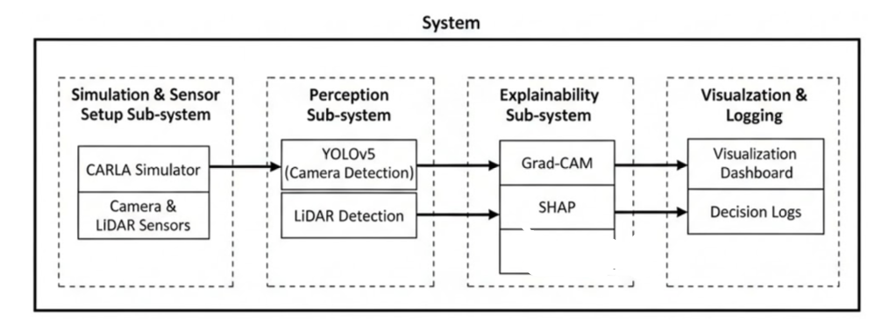
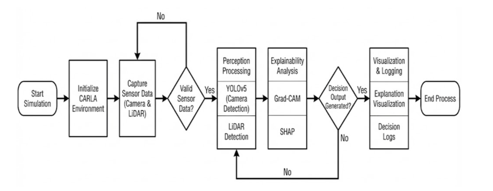
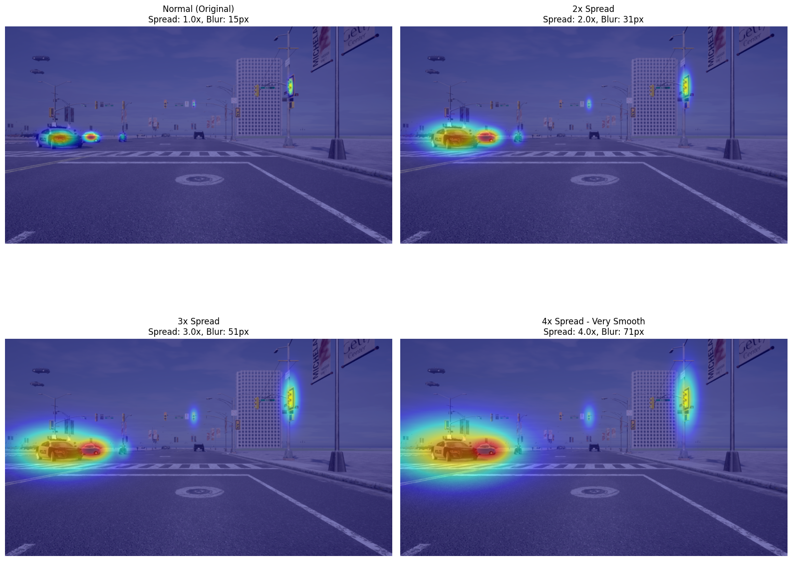
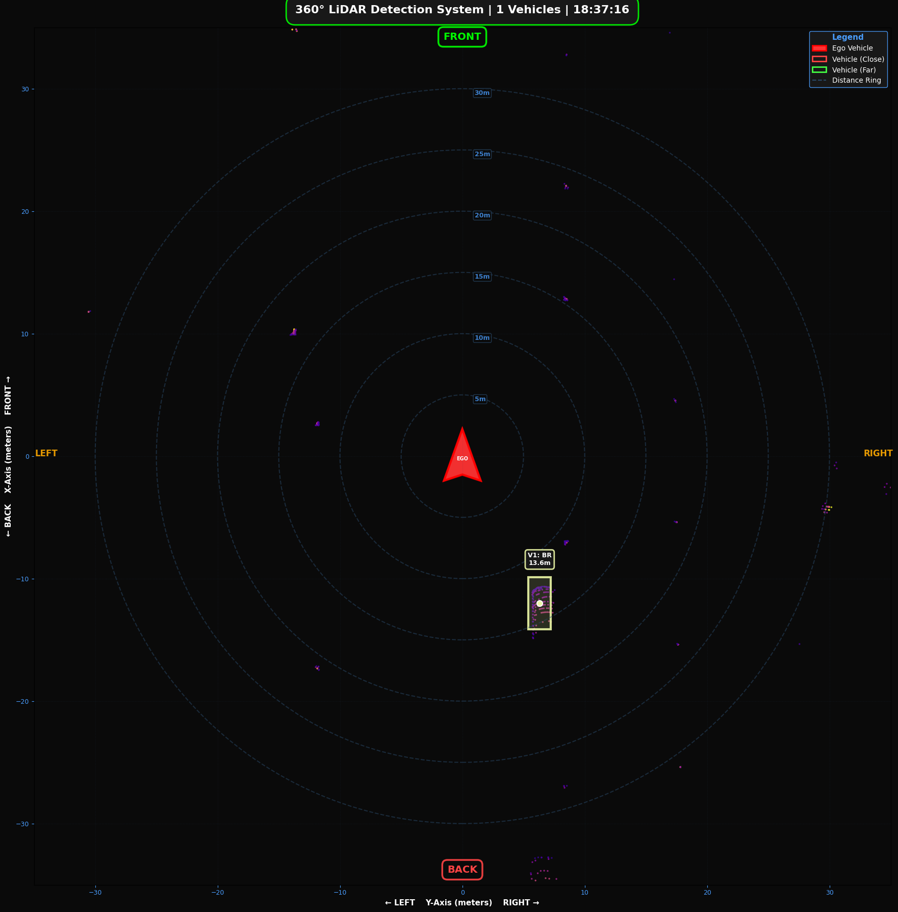
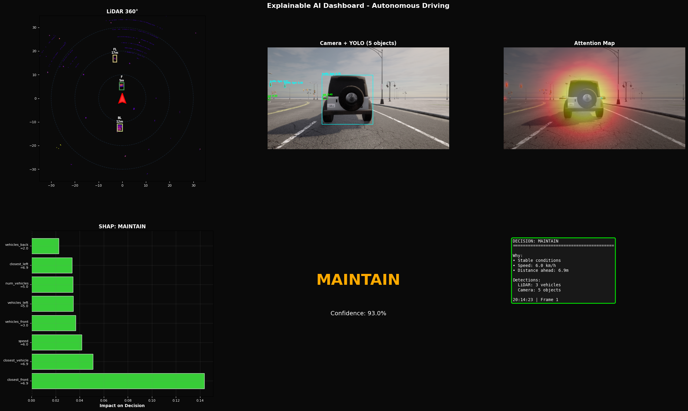
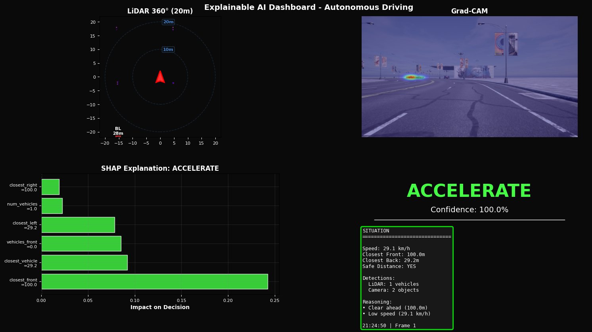
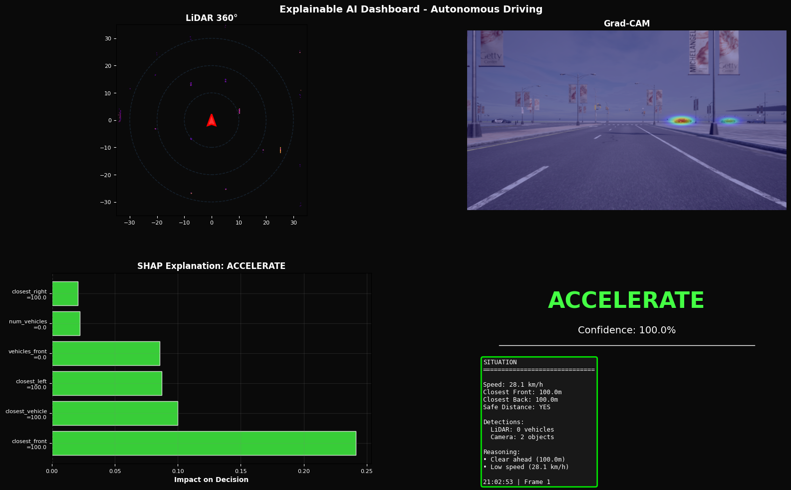
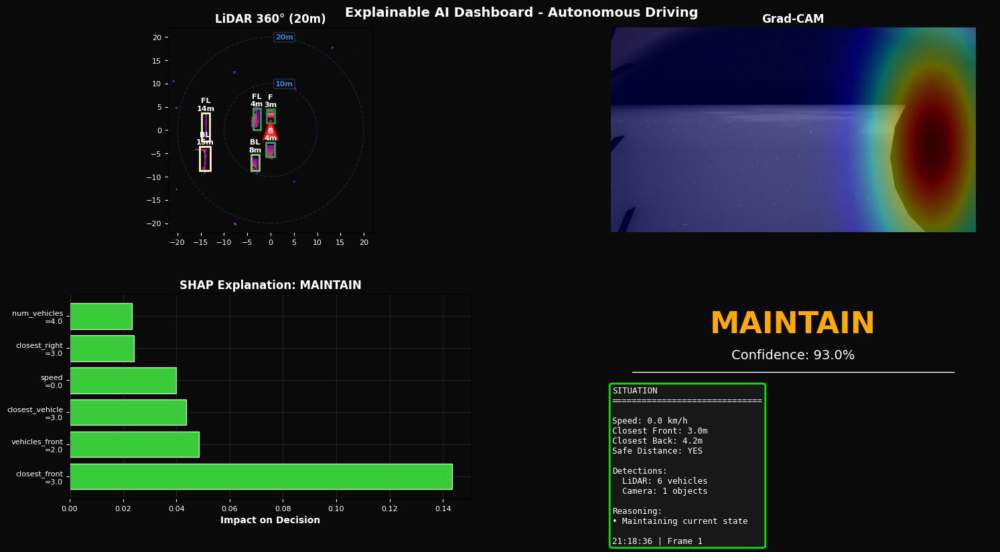

# 🚗 Explainable AI for Autonomous Vehicles

**AIN4312 – Special Topics in AI Engineering II**

An end-to-end Explainable Artificial Intelligence (XAI) system for autonomous driving built using the CARLA simulator. The project focuses on making autonomous vehicle decisions transparent, interpretable, and auditable by combining perception, decision logic, and explainability techniques.

**This system answers a critical question in autonomous driving:**  
*Why did the vehicle decide to accelerate, brake, or maintain speed in this exact situation?*

---

## 📌 Project Highlights

- ✅ Full CARLA-based autonomous driving simulation
- 📷 RGB camera + LiDAR sensing
- 🎯 YOLOv5 vehicle detection (Nano, Small, Medium comparison)
- 🔍 Grad-CAM visual explanations for perception models
- 📡 LiDAR-based spatial reasoning for surrounding vehicles
- 🧠 Feature-driven driving decision model
- 📊 SHAP explanations for every driving action
- 🖥️ Real-time multi-panel dashboard combining perception and explainability

**This project represents a complete explainable autonomy prototype rather than a standalone experiment or a toy notebook.**

---

## 🧠 Motivation

Autonomous driving models often operate as **black boxes**, especially in safety-critical scenarios. While predictions may be accurate, the reasoning behind them is hidden, which creates safety and trust concerns.

This project introduces explainability at two levels:

### 1. Perception Explainability
*What regions of the scene influenced object detection?*

### 2. Decision Explainability
*Which features caused the vehicle to accelerate, brake, or maintain speed?*

---

## 🏗️ System Pipeline

```
CARLA Simulator
   ↓
RGB Camera + LiDAR Sensors
   ↓
Perception (YOLOv5 + LiDAR Processing)
   ↓
Feature Extraction
   ↓
Driving Decision Model
   ↓
Explainability (Grad-CAM + SHAP)
   ↓
Real-Time Dashboard
```

---

## 🧩 Architecture and Interface

The system integrates multiple components into a unified explainable autonomy framework, processing sensor data through perception models and providing human-interpretable explanations for every driving decision.

### System Interface Diagram


### Process Flow


---

## 👁️ Perception Explainability

### Grad-CAM Attention Maps
Visualizes where the object detection model focuses when identifying traffic elements, providing insight into the perception process.



---

## 📡 LiDAR Perception

LiDAR provides **360° spatial awareness**, enabling reasoning about:
- Relative vehicle positions
- Safe distances
- Surrounding traffic density



---

## 🧮 Explainable Driving Decisions (SHAP)

Every driving decision is accompanied by a **feature-level explanation**.

**Example output:**
```
Predicted Action: MAINTAIN

Top contributing features:
- closest_front        → increases likelihood
- speed                → increases likelihood
- vehicles_back        → decreases likelihood
```

This makes the decision **traceable and auditable**.

---

## 🖥️ Real-Time Dashboard

The dashboard runs live during simulation and displays:
- 📡 LiDAR spatial visualization
- 🔍 Grad-CAM attention overlays
- 📊 SHAP feature importance
- 🚗 Current decision and vehicle telemetry

### Dashboard Snapshots






**The system successfully produces synchronized perception, explanation, and decision outputs at runtime inside the CARLA environment.**

---

## 🧰 Technology Stack

- **Python** 3.7
- **CARLA Simulator**
- **PyTorch**
- **YOLOv5** (v7.0)
- **OpenCV**
- **Grad-CAM**
- **SHAP**
- **NumPy, Pandas, Scikit-learn**
- **Matplotlib, Seaborn**

---

## 📁 Repository Structure

```
explainable-ai-autonomous-vehicles/
├─ assets/        # Diagrams, attention maps, dashboard screenshots
├─ notebooks/     # Full implementation notebook
├─ report/        # Final course report (PDF)
├─ slides/        # Final presentation slides
├─ README.md
├─ requirements.txt
```

---

## ⚙️ Setup and Execution

### Environment Requirements
- Python 3.7.x
- CUDA 11.3 (optional, CPU supported)
- CARLA Simulator installed locally

### Install Dependencies
```bash
pip install -r requirements.txt
```

### Install CARLA Python API
```bash
pip install /path/to/CARLA/PythonAPI/carla/dist/carla-*.egg
```

### Start CARLA
Launch the CARLA server (`CarlaUE4.exe` or `CarlaUE4.sh`).

### Run the Project
Open and execute:
```
notebooks/XAI for Autonomous Vehicles Code.ipynb
```
Run cells sequentially.

---

## ⚠️ Known Limitations

- Simulation-only environment
- No end-to-end neural driving policy
- Performance depends on GPU availability

*These limitations are explicitly documented and intentional.*

---

## 🔮 Future Improvements

- Multi-sensor fusion (camera + LiDAR + radar)
- Temporal explainability across video sequences
- End-to-end policy learning with explainability constraints
- Transfer learning to real-world datasets

---

## 👥 Team

- Abdullah Hani Abdellatif Al-Shobaki
- Mohamed Ahmed Allabani
- Mohamed Aiman Mohamed Alkhozendar
- Masa Yousef Bokhary
- Abdullah Shaher Salamoun

---

## 🎓 Course Context

This project was developed as the final project for **AIN4312 – Special Topics in AI Engineering II**, with a focus on Explainable AI for safety-critical autonomous systems.

---

## 📄 License

This project is licensed under the MIT License - see the [LICENSE](LICENSE) file for details.

---

## 🙏 Acknowledgments

Special thanks to **Prof. Murat Goksin**, the instructor of **AIN4312 – Special Topics in Artificial Intelligence Engineering II** at **Bahçeşehir University**, as well as the teaching assistants of the course, for their guidance, feedback, and support throughout the development of this project.
